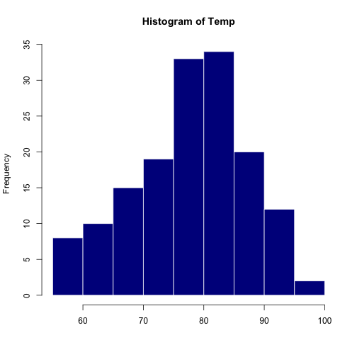

Pitch: Coursera Data Products Course Project
========================================================
author: Martijn van Gorp
date: May 2016
autosize: true
transition: rotate

Course Project: the app and the presentation
========================================================
The result of this course project contains (1) a Shiny Application and (2) this Presentation.

### 1. The Shiny Application:
- It contains a selectbox and a slider
- The values of these input fields, influence the histogram
- Short documentaion is provided in the app itself

### 2. This Presentation:
- It is done in Rstudio Presenter
- It contains 5 pages (you are now on page 1!)
- It is hosted on Rpubs
- And contains some embedded R code. See next slide.


Shiny Application: What is it?
========================================================
- With this application you can view the Airquality dataset
- The data is displayed in a Histogram
- You can manipulate the Histogram through an easy to use Panel


Shiny Application: How to manipulate the result?
========================================================
With the Panel you can manipulate the Histogram by:

1. choosing the column you want to be displayed
2. selecting the number of bins


<span class="caption">Figure 1: Screenshot of the Panel</span>

Shiny Application: what is the result
========================================================
For example, for the column "Temp" with the number of bins to 10, you will see the following result:


```r
# Code for those who are interested
hist(airquality$Temp, breaks = 10, border = 'white', col = 'darkblue', main = paste('Histogram of Temp'), xlab = "")
```




